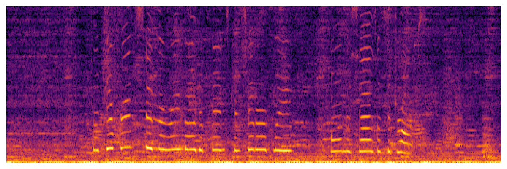
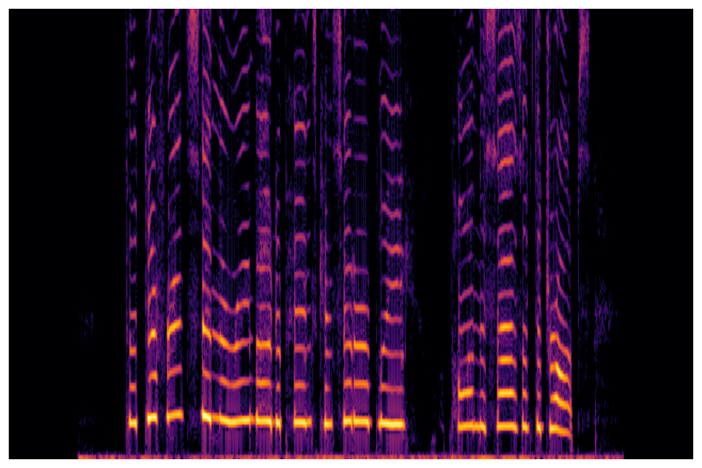
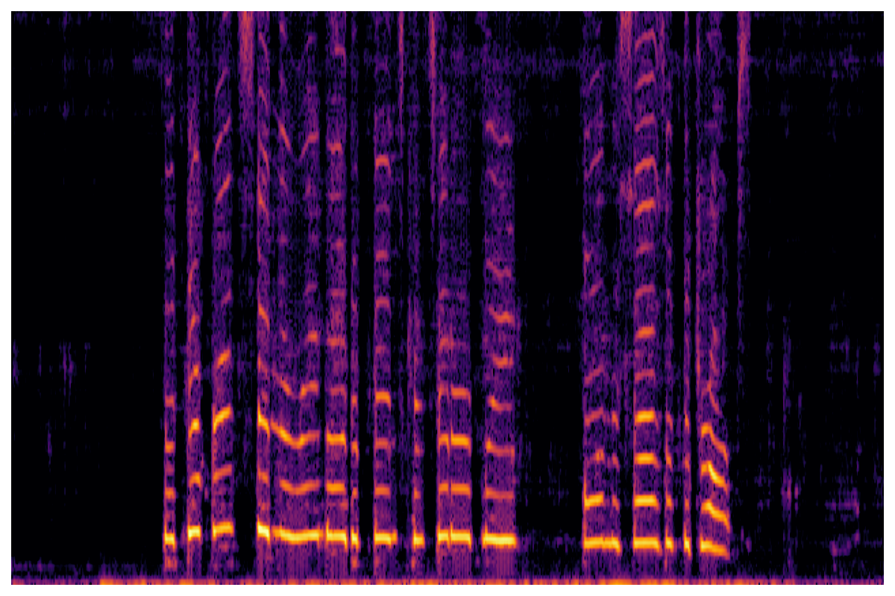
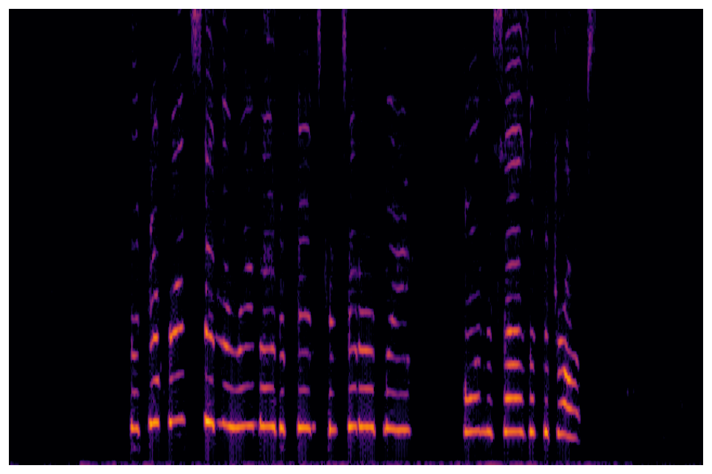
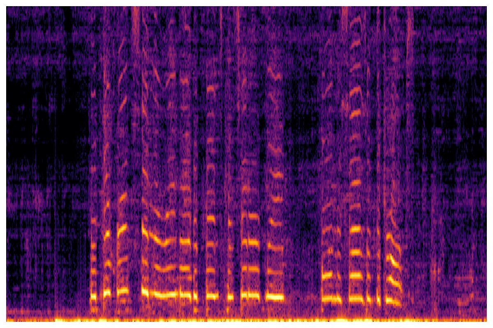

# ICASSP 2026 — Neural Variable Span Filters for Interpretable Speech Enhancement

## Introduction

This webpage is intended as a companion to the 2026 IEEE International Conference on Acoustics, Speech, and Signal Processing (ICASSP) paper, "Neural Variable Span Filters for Interpretable Speech Enhancement".

Here, we present audio samples filtered by our proposed Hybrid Variable Span Filter (HVSF).
We present audio samples filtered by the HVSF with various multipliers applied to its $\mu$ parameter to demonstrate the effect of the multiplier on the tradeoff between speech distortion and noise reduction.

## Results

|  | Spectrogram | Audio |
| :---: | :---: | :---: |
| Input |  | <audio controls> <source src="./audio/00035/input.mp3" type="audio/mpeg"> </audio> |
| Target |  | <audio controls> <source src="./audio/00035/target.mp3" type="audio/mpeg"> </audio> |
| Estimate |  | <audio controls> <source src="./audio/00035/output.mp3" type="audio/mpeg"> </audio> |
| Estimate ($\hat{\mu} \times 0.05 $) |  | <audio controls> <source src="./audio/00035/output_MuX20.mp3" type="audio/mpeg"> </audio> |
| Estimate ($\hat{\mu} \times 20 $) |  | <audio controls> <source src="./audio/00035/output_MuX005.mp3" type="audio/mpeg"> </audio> |

