# Multi-Channel Speech Enhancement Database: Mix of EARS and WHAM

## Database of clean and noisy speech samples

We present samples from __MIX-EARS-WHAM__, the database we developed to train and evaluate multi-channel speech enhancement methods.
This database was created using the [`Python`](https://www.python.org/) programming language and the [`pyroomacoustics`](https://pyroomacoustics.readthedocs.io/) library.

We mixed clean-speech audio signals from the Expressive Anechoic Recordings of Speech ([EARS](https://sp-uhh.github.io/ears_dataset/)) dataset, and ambient-noise audio signals from the WSJ0 Hipster Ambient Mixtures ([WHAM!](http://wham.whisper.ai)) dataset.

Here, we report signals with __2__ channels, in order for the listener to assess the stereophonic properties of the signals.

## Sample 1: _SIR = -6 dB, SNR = -6 dB_

| Noisy Mixture | Clean Speech | Overall Noise |
| :---: | :---: | :---: |
| 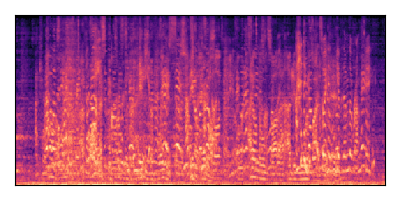 | 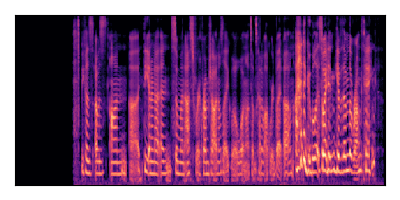 | 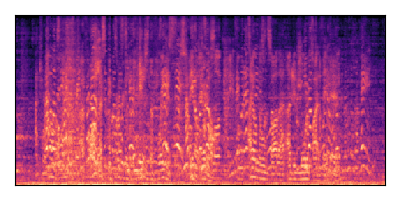 |
| <audio controls> <source src="./data/00667/noisy_mixture.mp3" type="data/mpeg"> </audio> | <audio controls> <source src="./data/00667/target_speech.mp3" type="data/mpeg"> </audio> | <audio controls> <source src="./data/00667/overall_noise.mp3" type="data/mpeg"> </audio> |

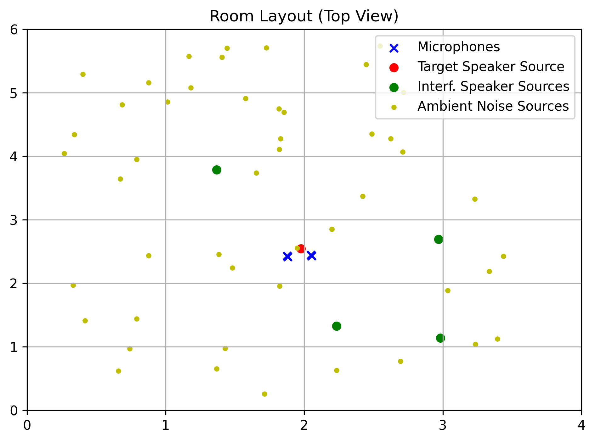

## Sample 2: _SIR = -6 dB, SNR = +6 dB_

| Noisy Mixture | Clean Speech | Overall Noise |
| :---: | :---: | :---: |
| 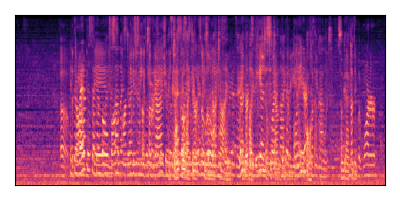 | 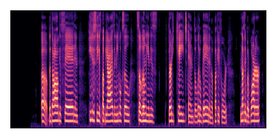 | 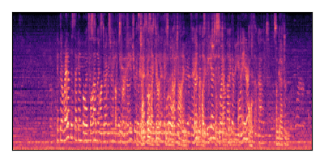 |
| <audio controls> <source src="./data/01200/noisy_mixture.mp3" type="data/mpeg"> </audio> | <audio controls> <source src="./data/01200/target_speech.mp3" type="data/mpeg"> </audio> | <audio controls> <source src="./data/01200/overall_noise.mp3" type="data/mpeg"> </audio> |

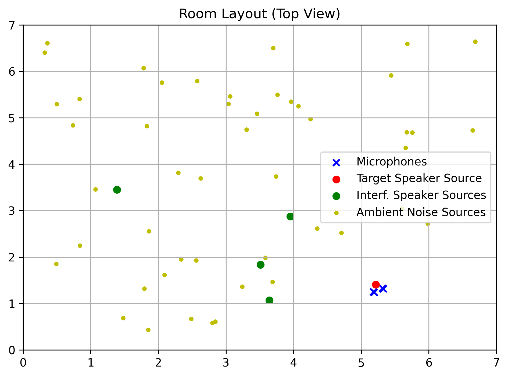

## Sample 3: _SIR = +6 dB, SNR = -6 dB_

| Noisy Mixture | Clean Speech | Overall Noise |
| :---: | :---: | :---: |
| 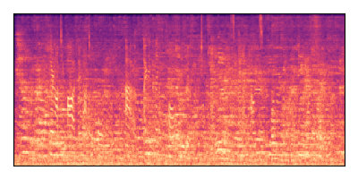 |  | 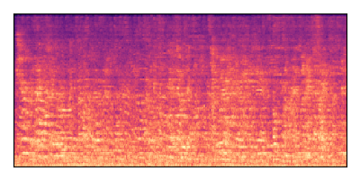 |
| <audio controls> <source src="./data/00670/noisy_mixture.mp3" type="data/mpeg"> </audio> | <audio controls> <source src="./data/00670/target_speech.mp3" type="data/mpeg"> </audio> | <audio controls> <source src="./data/00670/overall_noise.mp3" type="data/mpeg"> </audio> |

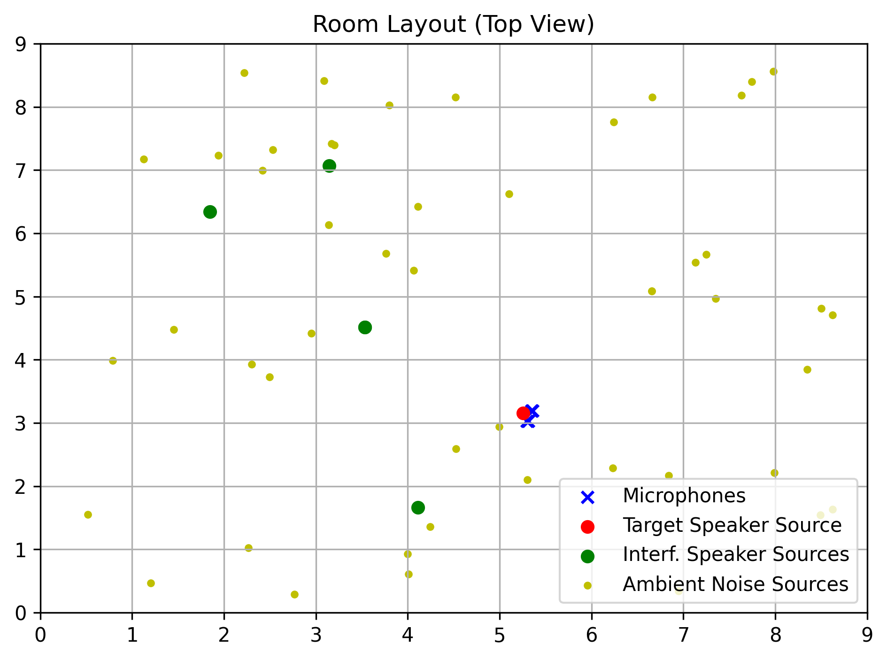

## Sample 4: _SIR = +6 dB, SNR = +6 dB_

| Noisy Mixture | Clean Speech | Overall Noise |
| :---: | :---: | :---: |
| 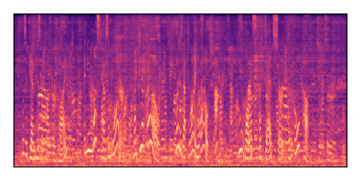 | 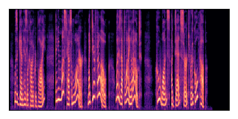 | 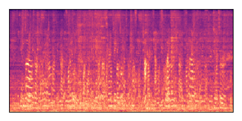 |
| <audio controls> <source src="./data/00102/noisy_mixture.mp3" type="data/mpeg"> </audio> | <audio controls> <source src="./data/00102/target_speech.mp3" type="data/mpeg"> </audio> | <audio controls> <source src="./data/00102/overall_noise.mp3" type="data/mpeg"> </audio> |

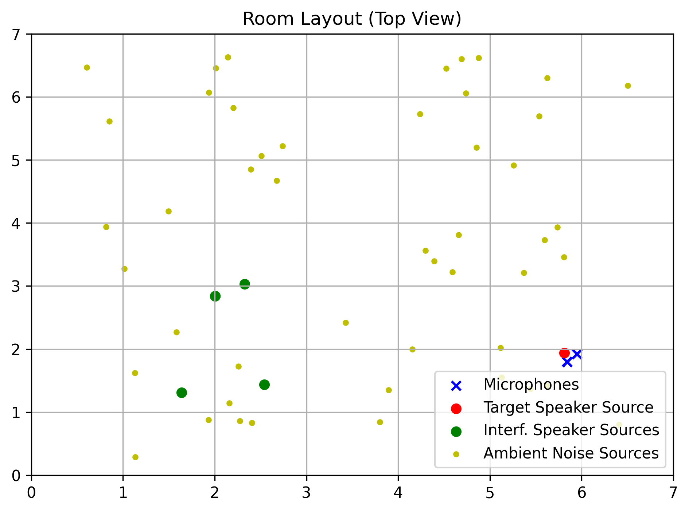

