# Database for Multi-Channel Speech Enhancement: Mix of EARS and WHAM

We present samples from __MIX-EARS-WHAM__, the database we developed to train and evaluate multi-channel speech enhancement methods.
This database, comprised of approximately 40,000 pairs of clean-speech and noisy-mixture audio signals, was created using the [`Python`](https://www.python.org/) programming language and the [`pyroomacoustics`](https://pyroomacoustics.readthedocs.io/) library.

We mixed clean-speech audio signals from the Expressive Anechoic Recordings of Speech ([EARS](https://sp-uhh.github.io/ears_dataset/)) dataset, and ambient-noise audio signals from the WSJ0 Hipster Ambient Mixtures ([WHAM!](http://wham.whisper.ai)) dataset.
Signals from EARS were filtered with a biquad highpass filter (cutoff frequency 70 Hz) to remove an observed high-power, low-frequency noise.
More details on the pre-processing of EARS and on how the mixtures are generated are available on the associated paper.

Here, we report signals with __2__ channels for web compatibility – in practice, we use signals with __4__ channels.

## Sample 1: _SIR = +6 dB, SNR = +6 dB_

| Noisy Mixture | Clean Speech | Overall Noise |
| :---: | :---: | :---: |
| 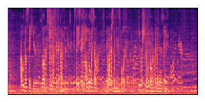 | 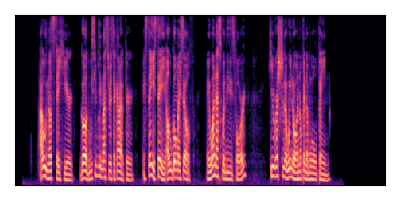 | 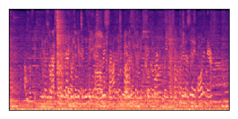 |
| <audio controls> <source src="./data/01087/noisy_mixture.mp3" type="audio/mpeg"> </audio> | <audio controls> <source src="./data/01087/target_speech.mp3" type="audio/mpeg"> </audio> | <audio controls> <source src="./data/01087/overall_noise.mp3" type="audio/mpeg"> </audio> |

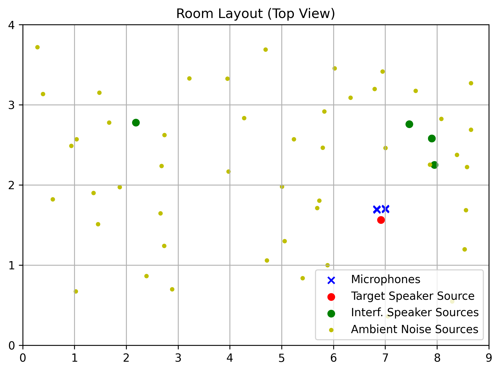

## Sample 2: _SIR = 0 dB, SNR = +6 dB_

| Noisy Mixture | Clean Speech | Overall Noise |
| :---: | :---: | :---: |
| 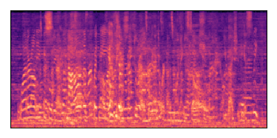 | 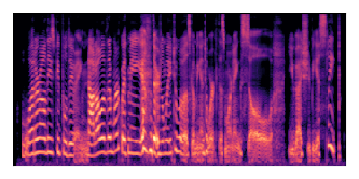 | 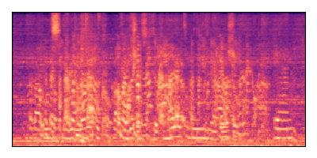 |
| <audio controls> <source src="./data/00715/noisy_mixture.mp3" type="audio/mpeg"> </audio> | <audio controls> <source src="./data/00715/target_speech.mp3" type="audio/mpeg"> </audio> | <audio controls> <source src="./data/00715/overall_noise.mp3" type="audio/mpeg"> </audio> |

## Sample 3: _SIR = +6 dB, SNR = -6 dB_

| Noisy Mixture | Clean Speech | Overall Noise |
| :---: | :---: | :---: |
| 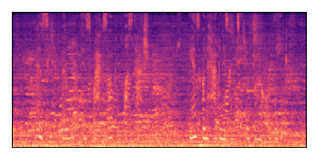 | 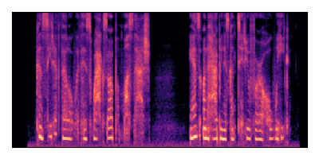 | 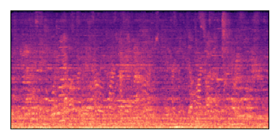 |
| <audio controls> <source src="./data/00359/noisy_mixture.mp3" type="audio/mpeg"> </audio> | <audio controls> <source src="./data/00359/target_speech.mp3" type="audio/mpeg"> </audio> | <audio controls> <source src="./data/00359/overall_noise.mp3" type="audio/mpeg"> </audio> |

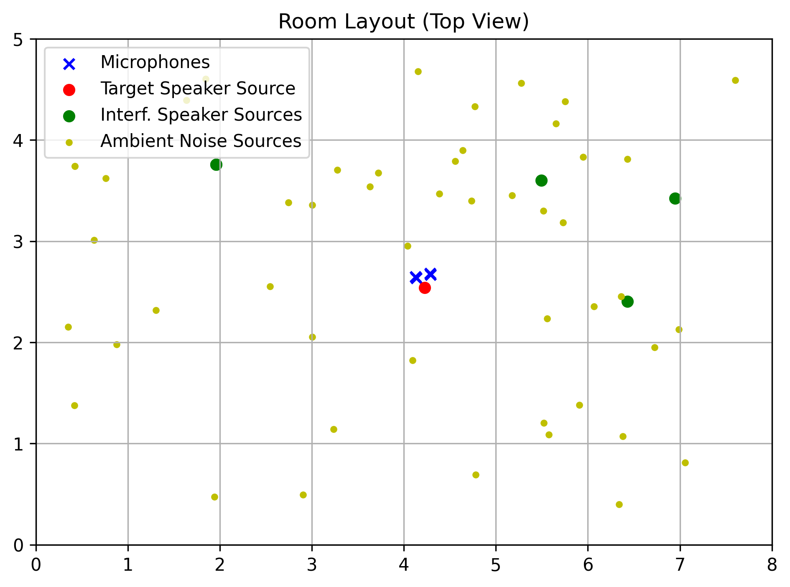

## Sample 4: _SIR = 0 dB, SNR = -6 dB_

| Noisy Mixture | Clean Speech | Overall Noise |
| :---: | :---: | :---: |
| 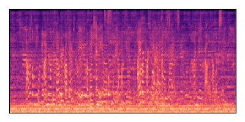 | 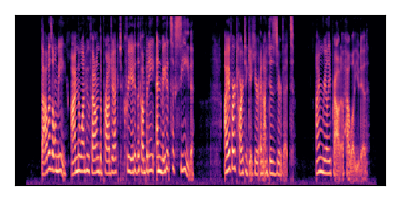 | 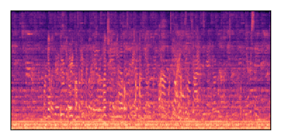 |
| <audio controls> <source src="./data/00285/noisy_mixture.mp3" type="audio/mpeg"> </audio> | <audio controls> <source src="./data/00285/target_speech.mp3" type="audio/mpeg"> </audio> | <audio controls> <source src="./data/00285/overall_noise.mp3" type="audio/mpeg"> </audio> |

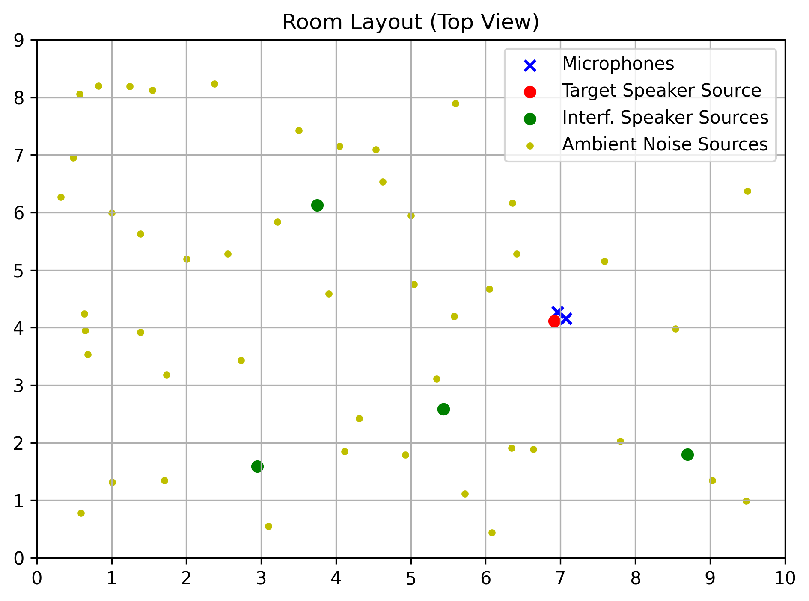

