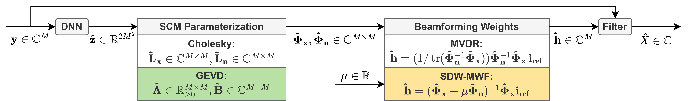
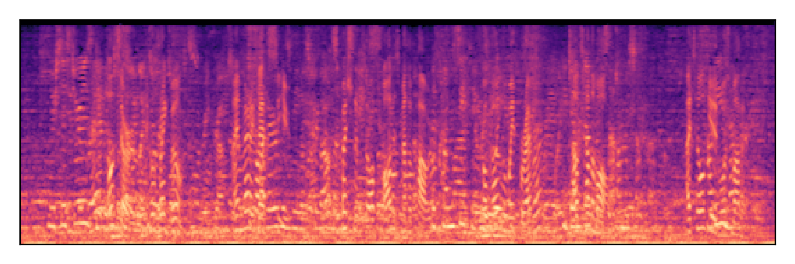
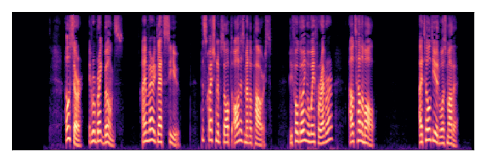
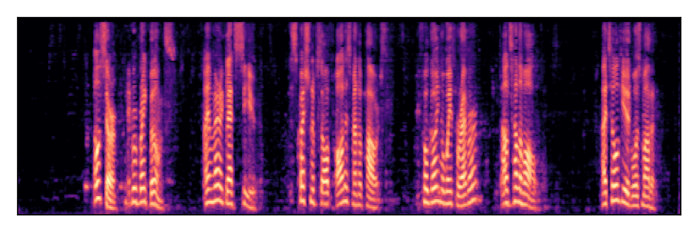
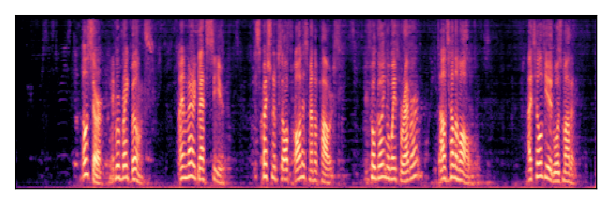
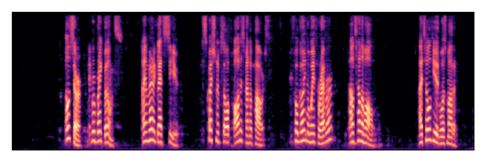
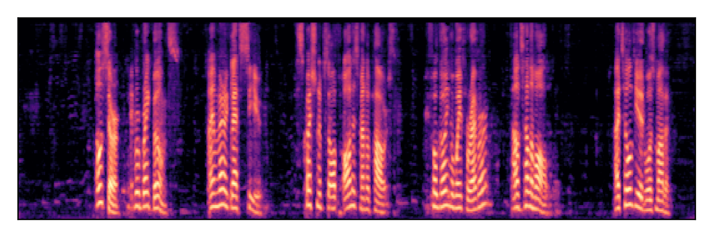
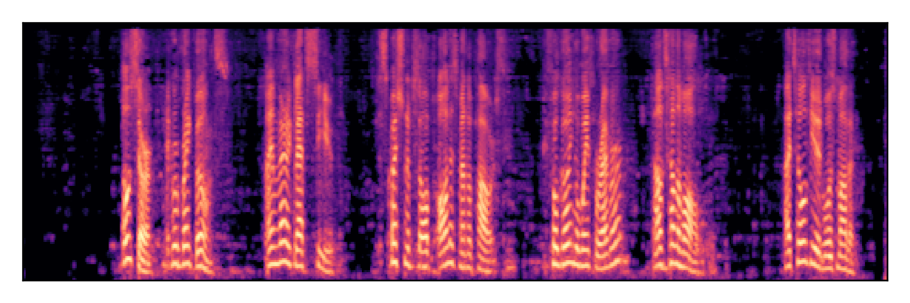
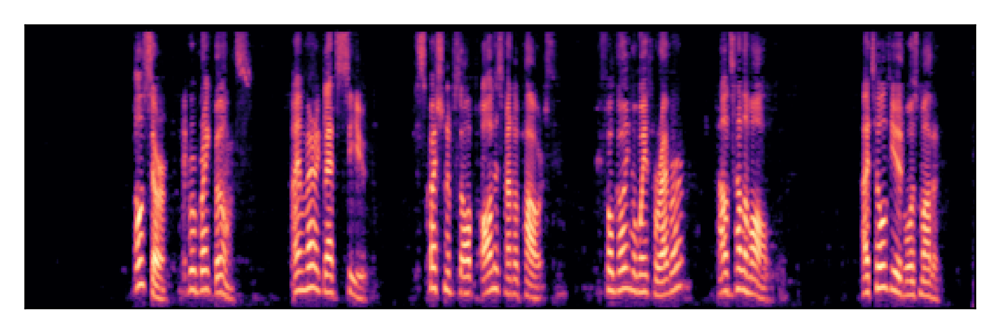

# Neural GEVD Estimation with MWF Beamforming for Controllable Multichannel Speech Enhancement
## IEEE Open Journal of Signal Processing (OJSP) 2026

The present webpage is intended as a companion to the 
IEEE OJSP 2026 paper, [_Neural GEVD Estimation with MWF Beamforming for Controllable Multichannel Speech Enhancement_]() by T. Oviste, ... and M. G. Christensen.

Here, we present audio samples filtered by four hybrid architectures for multichannel speech enhancement, namely the CHOL+MVDR, CHOL+MWF, GEVD+MVDR and GEVD+MWF architectures studied in the publication, as represented in the figure below.
Additionally, for +MWF models, we present audio samples filtered with different post-training values for the tradeoff parameter $\mu$.
The DNN architecture leveraged for these models is the FTJNF (see publication for more details).

## Sample 1: 

| Model | Magnitude Spectrogram | Audio |
| :---: | :---: | :---: |
| Noisy Mixture  (SNR = -3 dB, SIR= -1 dB)|  | <audio controls> <source src="./audio/01474/noisy_mixture.mp3" type="audio/mpeg"> </audio> |
| Target Speech |  | <audio controls> <source src="./audio/01474/target_speech.mp3" type="audio/mpeg"> </audio> |
| __CHOL+MVDR__ |  | <audio controls> <source src="./audio/01474/CHOL+MVDR_filtered_mixture.mp3" type="audio/mpeg"> </audio> |
| __CHOL+MWF__  (μ = 1.0) |  | <audio controls> <source src="./audio/01474/CHOL+MWF_mu10_filtered_mixture.mp3" type="audio/mpeg"> </audio> |
| __CHOL+MWF__  (μ = 0.1) |  | <audio controls> <source src="./audio/01474/CHOL+MWF_mu01_filtered_mixture.mp3" type="audio/mpeg"> </audio> |
| __CHOL+MWF__  (μ = 5.0) |  | <audio controls> <source src="./audio/01474/CHOL+MWF_mu50_filtered_mixture.mp3" type="audio/mpeg"> </audio> |
| __GEVD+MVDR__ |  | <audio controls> <source src="./audio/01474/GEVD+MVDR_filtered_mixture.mp3" type="audio/mpeg"> </audio> |
| __GEVD+MWF__  (μ = 1.0) |  | <audio controls> <source src="./audio/01474/GEVD+MWF_mu10_filtered_mixture.mp3" type="audio/mpeg"> </audio> |
| __GEVD+MWF__  (μ = 0.1) |  | <audio controls> <source src="./audio/01474/GEVD+MWF_mu01_filtered_mixture.mp3" type="audio/mpeg"> </audio> |
| __GEVD+MWF__  (μ = 5.0) |  | <audio controls> <source src="./audio/01474/GEVD+MWF_mu50_filtered_mixture.mp3" type="audio/mpeg"> </audio> |
