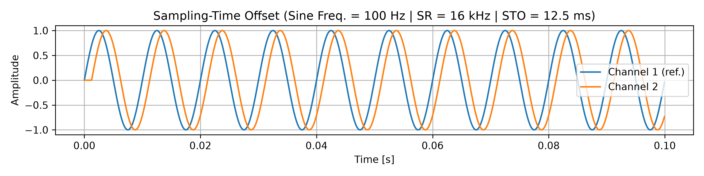
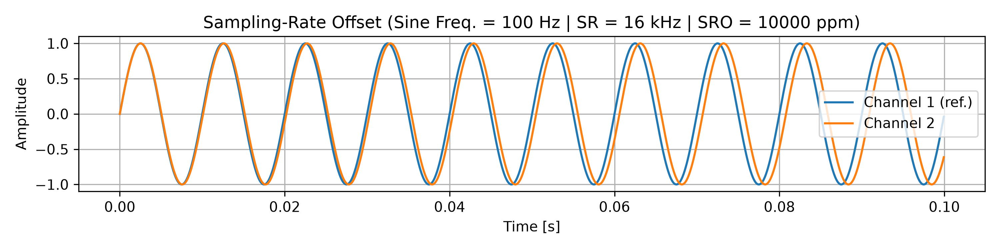
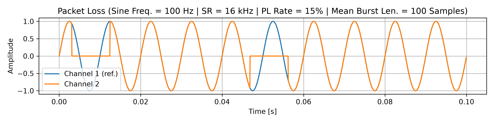

# Simulating Synchronization Imperfections in Wireless Acoustic Sensor Networks

<!--------------------------------------->
## Sampling-Time Offset (STO)

### Waveform Example

### Audio Example

| Ideal | With STO () |
| :---: | :---: |
| <audio controls> <source src="./audio/69_stereo.mp3" type="audio/mpeg"> </audio> | <audio controls> <source src="./audio/69_stereo.mp3" type="audio/mpeg"> </audio> |

<!--------------------------------------->
## Sampling-Rate Offset (SRO)

### Waveform Example

Sidenote: traditional values for SRO are generally found between 0 and 100 ppm – it is exaggerated here for the sake of visualization.

### Audio Example

| Ideal | With STO () |
| :---: | :---: |
| <audio controls> <source src="./audio/69_stereo.mp3" type="audio/mpeg"> </audio> | <audio controls> <source src="./audio/69_stereo.mp3" type="audio/mpeg"> </audio> |

<!--------------------------------------->
## Packet Loss

Gilbert-Elliott probabilistic model (Chinaev et al. 2021)

### Waveform Example

### Audio Example

Left channel chosen as reference.  
Right channel 

| Ideal | With STO () |
| :---: | :---: |
| <audio controls> <source src="./audio/69_stereo.mp3" type="audio/mpeg"> </audio> | <audio controls> <source src="./audio/69_stereo.mp3" type="audio/mpeg"> </audio> |
